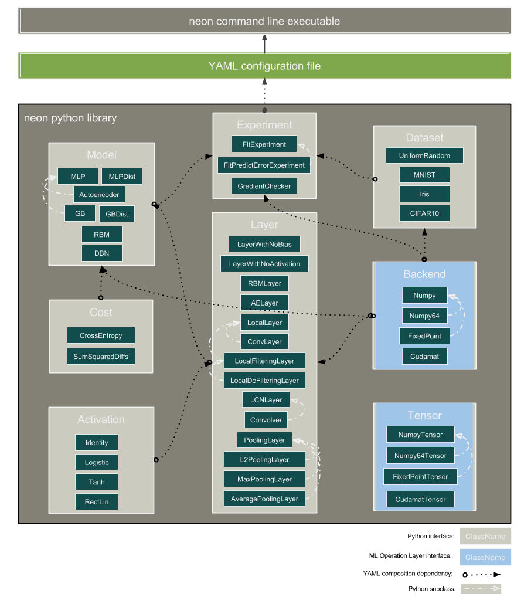

Contributing to Neon
====================

Basic Process
-------------

1. Create a story in JIRA to track your work:
   https://nervanasys.atlassian.net/browse/MYL
   We tend to do 1 week code sprints starting each Tuesday after the Algorithms
   meeting.  Talk to Scott to ensure your tickets get added to the next sprint.

2. Clone and/or update your checked out copy of neon to ensure you have the
   most recent commits from the master branch::

    git clone git@192.168.20.2:algorithms/neon.git
    cd neon
    git fetch origin
    git checkout master
    git pull

3. Create a new feature branch for your work and switch to it.  Give it a
   meaningful name related to the task(s) at hand::

    # to do both steps at once:
    git checkout -b my_new_feature_branch
    # or separately:
    git branch my_new_feature_branch
    git checkout my_new_feature_branch

4. Ideally you'd start by creating one or more unit tests with the
   functionality you expect your new feature to perform.  These should reside
   under the appropriate tests subdirectory of whatever you are changing.
   Then hack away at the code until you feel your feature is complete.  Once
   satisfied, run the code through the tests and various style checking::

    make test   # ensure all are OK!
    make style  # ensure there are no style related issues
    make lint   # (optional).  We still have a fair bit to clean up currently!

5. If necessary you may want to update and/or rebuild the documentation.
   This all exists under doc/source and is in 
   `Sphinx Restructed Text format <http://sphinx-doc.org/rest.html>`_::

    make doc         # builds documentation locally
    make publish_doc # builds documentation and publishes to:
                     # http://192.168.20.2:5700

6. Commit your changes and push your feature branch to gitlab.  Be sure to
   add a descriptive message and reference the JIRA issue associated with
   your task (ex. MYL-20)::

    git add my_updated_file.txt
    git commit -m "Added new awesome functionality.  Closes MYL-20"
    git push origin my_new_feature_branch

7. Create a new merge request to get your feature branch merged into master for
   others to use.  You may want to assign the request to someone else for a
   code review.  You should also ensure all your tests pass when run on the 
   continuous integration server::

    http://192.168.20.2/algorithms/neon/merge_requests # "New Merge Request"
    http://192.168.20.2:82/                            # Our CI server web GUI.

8. Once your change has been successfully merged, you can remove the source
   branch and ensure your local copy is up to date::

    git fetch origin
    git checkout master
    git pull
    git branch -d my_new_feature_branch
    git branch -d -r origin/my_new_feature_branch

9. Give yourself a high five for a job well done!

Architecture
------------

Roadmap
-------

* https://sites.google.com/a/nervanasys.com/wiki/algorithms/neon/roadmap

How to Add a new model type
---------------------------

* https://sites.google.com/a/nervanasys.com/wiki/algorithms/neon/how-to-write-a-neon-model
