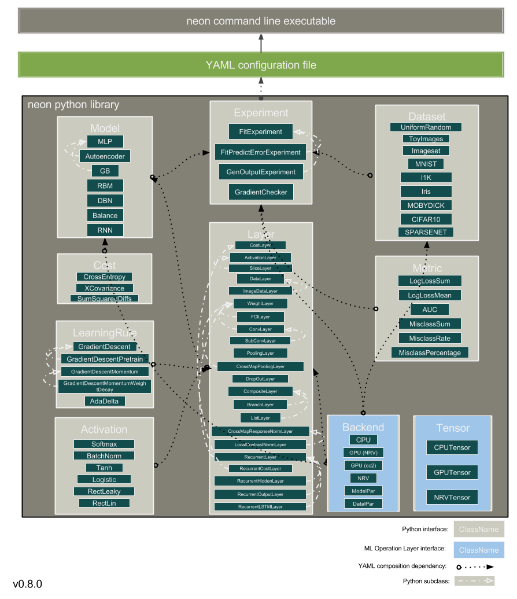

.. ---------------------------------------------------------------------------
.. Copyright 2014 Nervana Systems Inc.  All rights reserved.
.. ---------------------------------------------------------------------------

Contributing to the Framework
=============================

.. include:: ../../CONTRIBUTING.rst

Architecture
------------

Extending the Framework
-----------------------

The process for adding a new type of model, layer, dataset, and so forth is
typically the same.  You start by inheriting from the base class of the
construct being extended, then fill in a handful of required functions.

The specifics for extending each type of construct can be found at the
following links:

* :ref:`extending_experiment`
* :ref:`extending_dataset`
* :ref:`extending_model`
* :ref:`extending_layer`
* :ref:`extending_learningrule`
